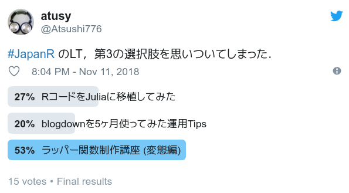
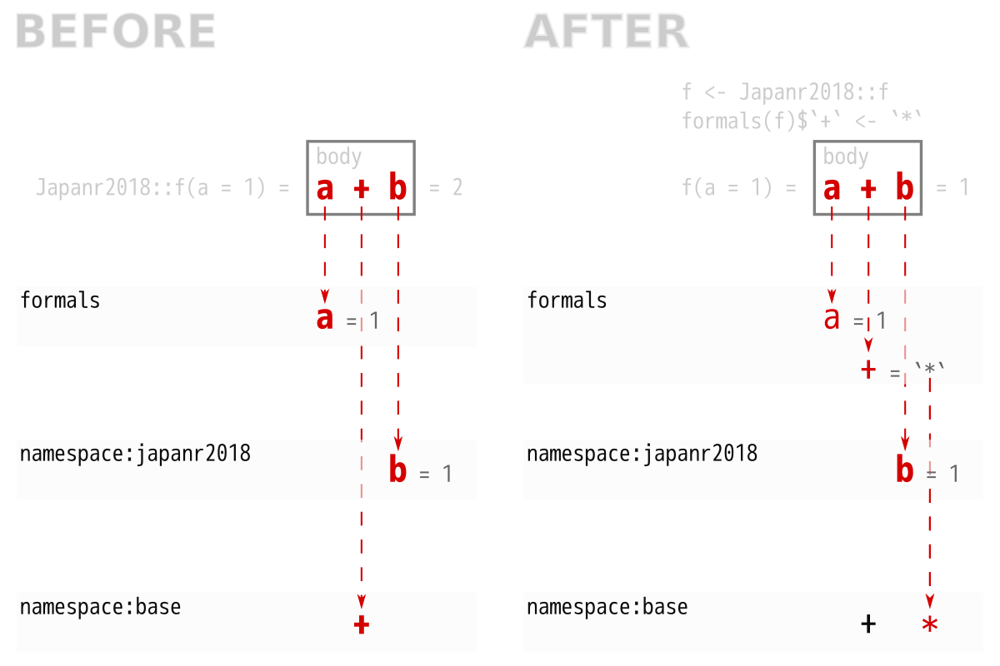

```{r setup, include = FALSE}
library(japanr2018)
library(pacman)
p_load(knitr, skimr, magrittr, ggplot2)
p_load_gh("rkrug/plantuml")
theme_set(theme_classic())
opts_chunk$set(cache = TRUE)
```

## {height=50px} atusy 


- R歴5年
- 11月から Julia 始めました!
- 初Japan R \
  <small> https://atusy.github.io/presentation/japanr2018/formals-for-black-magicians.html </small>
- Tokyo R 73で
  [`ggplot2` で図を並べる](https://atusy.github.io/presentation/tokyor073/tokyor073-multi-ggplot2.html#/)
  話をした
- [(株) 蒜山地質年代学研究所](http://geohiruzen.co.jp/)
    - 所在地は岡山市内
    - 業務
        - 地質試料の化学分析
        - データ解析用Rパッケージ開発
- `blogdown` で
  [blogしてます](https://atusy.github.io/blog/)
- @[Atsushi776](https://twitter.com/Atsushi776) on Twitter

## {#tweet-yuta-mona}

[](https://twitter.com/teramonagi/status/1013232146234802176)

## {#tweet-vote}

[](https://twitter.com/Atsushi776/status/1061575277724151808)

# 関数改造事始 {#intro}

## 改造は人の業 {#karma}

<div style ="text-align:left">

{width=50px}
[有意差でたよっ](https://blog.recyclebin.jp/archives/4369)

{width=50px}
[R で関数のデフォルト引数を変更する(魔改造編)](https://qiita.com/hoxo_m/items/cada02d3ec47e5b9c9b9)

{width=50px}
[メモ：httr::oauth2.0_token()のredirect_uriを変える](https://notchained.hatenablog.com/entry/2016/03/21/211535)

{width=50px}
[(R) skimrの表示をカスタマイズしたい 3回目（追記修正）](https://niszet.hatenablog.com/entry/2018/02/26/073000)

</div>

## ラッパー関数を作る {#wrapper}

```r
f <- function(a) a + 1 

f_hex <- 
  function(hex = "f") { # 引数名変更 & 初期値設定
    strtoi(hex, 16) %>% # 前処理
      f() %>%
        as.hexmode() # 後処理
  }

f_hex("a") # [1] "b"
```

## 名前空間に殴り込む {#assignInNamespace}

`assignInNamespace()`{.r}

- メリット
    - 内部変数を弄ることも含め、何でもできる
    - `formals` が対象なら便利なパッケージがある \
      ([hoxo-m/fixer](https://github.com/hoxo-m/fixer))
- デメリット
    - オブジェクト間の依存関係による予期せぬ副作用

## 関数の構成要素を魔改造する {#components-of-function}

構成要素| | > identity
:---|:---|:---
**formals** | 引数のリスト | function (**x**)
body | 関数内のコード | x
environment | 関数を格納した変数の居場所 | <environment: namespace:base>

## {#goal}

### `formals()`{.r} を弄って
### `assignInNamespace()`{.r} せずに
### 内部変数も含めて挙動を弄ろう

# `package:japanr2018`{.r} {#japanr2018}

## インストール & 読み込み {#jr18-install}

```r
devtools::install_github(
  "atusy/presentation",
  subdir = "japanr2018/pkg"
)

library(japanr2018)
```


## 中身 {#jr18-content}

```{r code-japanr2018, include = FALSE}
(code <- readLines("./pkg/R/source.R"))
```


```{r view-japanr2018, code = code, eval = FALSE}

```

## `namespace:japanr2018`{.r} に隔離 {#jr18-env}

```r
f
# function(a) a + b
# <bytecode: 0x3e05f08>
# <environment: namespace:japanr2018>

f <- 1
f
# [1] 1

japanr2018::f
# function(a) a + b
# <bytecode: 0x3e3d700>
# <environment: namespace:japanr2018>
```

`japanr2018::f`{.r} は上書きされない

# 既存の引数を弄る {#edit}

## `formals()`{.r} で関数の引数を確認する {#formals-of-f}

```r
str(formals(japanr2018::f))
# Dotted pair list of 1
# $ a: symbol 
```

ヘンなリストだけどリストのノリで弄れる。

## 弄るには`` `formals<-` ``{.r} {#assign-formals}

```{r assign-formals}
f <- japanr2018::f
formals(f) <- list(a = 1)
formals(f)
f()
```

## `alist()`{.r} を使うと遅延評価できる {#lazy-eval}

```{r assign-formals-with-alist}
f <- japanr2018::f
(formals(f)$a <- alist(a = rnorm(1))$a)
f()
f()
```

## `?formals`{.r} にも載ってるアブナい技 {#help-formals}

<div style="text-align:left">
> You can overwrite the formal arguments of a function (though this is advanced, dangerous coding). \
> `f <- function(x) a + b`{.r} \
> `formals(f) <- alist(a = , b = 3)`{.r} \
> `f    # function(a, b = 3) a + b`{.r} \
> `f(2) # result = 5`{.r}
</div>

# 引数を追加する {#black-magick}

## 確認 {#check-f-and-b}

```{r chk-jr18-f}
japanr2018::f
```

```{r chk-jr18-b}
japanr2018:::b
```

## `b`{.r} を `a`{.r} と同じ長さの乱数にしたい {#randomize-b}

```{r randomize-b}
f <- japanr2018::f
formals(f)$b <- alist(b = runif(length(a)))$b
f(1:3)
f(1:4)
```

## たし算じゃなくてかけ算がいい {#want-product}

```{r want-product}
f <- japanr2018::f
formals(f)$`+` <- `*`
f(1)
```


## {#whats-happening}

{width=900px}

## `japanr2018::g` は影響を受けない

```{r g-not-affected}
japanr2018::g(1) # g = function(a) f(a)
```

`assignInNamespace("b", 2, "japanr2018")`{.r} 

していたら

`japanr2018::g(1) == 3`{.r} 

になっていた


# 応用1 <br> ggplot2で密度分布の信頼区間を描写 {#stat-ci}

## `ggproto`{.r} で `StatCI`{.r} を定義 {#ggproto}

```{r statci-code, include = FALSE}
(StatCI_code <- readLines("https://raw.githubusercontent.com/atusy/ggAtusy/8502c1bb4a493a7c6a63b8d8bb92e14c9b78f1d0/R/stat_ci.R")[c(28:55, 14:18)])
```

```{r statci-code-view, code = StatCI_code}

```

## `ggplot2::stat_density()`{.r} を <br> `stat_ci()`{.r} に改造 {#stat-ci-goal}

```{r #code-stat-density}
ggplot2::stat_density # コピペ & 目sedは嫌だ
```

## {#implement-stat-ci}

`stat_density()`{.r} が呼び出す `StatDensity`{.r} を、 \
`ggplot2::StatDensity`{.r} から、引数の `StatDensity`{.r} に摩り替え

```{r stat-ci, fig.height = 1.5}
library(ggplot2)
stat_ci <- stat_density
formals(stat_ci) <- c(
  formals(stat_ci), 
  StatDensity = ggAtusy::StatCI
)
ggplot(data.frame(x = rnorm(1e5)), aes(x)) +
  geom_density() + stat_ci()
```

[実際には `StatDensity`{.r} 引数を弄れないよう、もう一工夫した。](https://github.com/atusy/ggAtusy/blob/master/R/stat_ci.R)

## Disclaimer

遊び半分の実装です。

実用的には 
[`ggdistribute`](https://cran.r-project.org/web/packages/ggdistribute/vignettes/geom_posterior.html)
や
[`bayseplot`](https://cran.r-project.org/web/packages/bayesplot/vignettes/plotting-mcmc-draws.html) 
があります。

# 応用2 <br> `skimr::inline_hist()`{.r} の <br /> ビン数を変更 {#modify-inline-hist}

## 内部変数 `skimr:::optioins` を弄る {#modify-options-in-skimr}

```{r inline-hist-10}
library(skimr)
skimr::inline_hist(iris$Petal.Length)
myopt <- rlang::env_clone(skimr:::options)
inline_hist <- skimr::inline_hist
myopt$formats$character$width <- 20
formals(inline_hist)$options = myopt
inline_hist(iris$Petal.Length)
```

<div style = "text-align:right">
[Inspired by {width=30px}](https://niszet.hatenablog.com/entry/2018/02/26/073000)
</div>

## 動的に `optioins`{.r} を弄る {#dynamic-options}

```{r inline-hist-any, eval = FALSE}
inline_hist <- skimr::inline_hist
.options <- function(n) {
  options <- rlang::env_clone(skimr:::options)
  options$formats$character$width <- n
  options
}
formals(inline_hist)[c("n", "options")] <- 
  alist(n = 10, options = .options(n))

inline_hist(iris$Petal.Length)     
# ▇▃▁▁▂▆▆▃▂▁
inline_hist(iris$Petal.Length, 20) 
# ▁▇▂▁▁▁▁▁▁▁▃▃▃▅▂▃▂▁▁▁
```


# 応用3 <br /> 関数を手抜きして作る {#lazy-programming}

## S3メソッドを手抜きして作る {#easy-s3}

```{r s3}
print.atusy <- function() {
  cat("Printing atusy class object.\n")
  NextMethod()
}
formals(print.atusy) <- formals(print)
structure(1, class = "atusy")
```

S3メソッドは最低でも、 \
総称関数と同じ引数を持たなければならない

`` `formals<-`() ``{.r} を使えば総称関数の引数を丸々引き継げる


